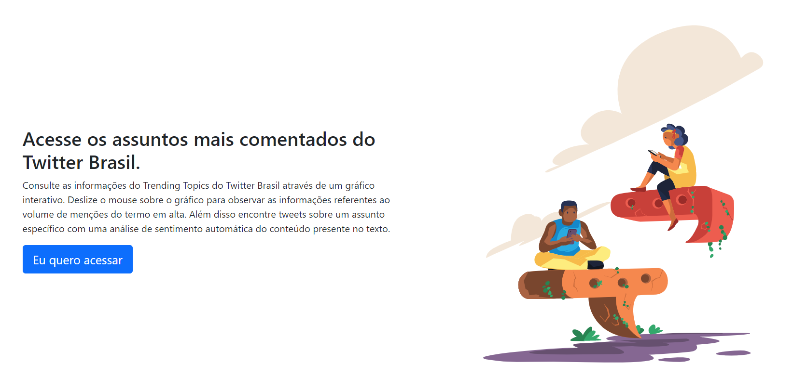
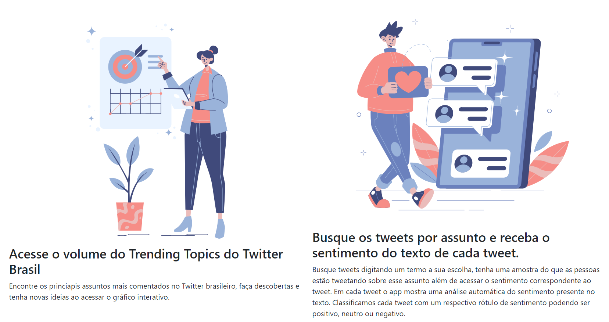

# isocialmedia
O iSocialMedia é um aplicativo teste no formato PWA, disponível para Android e PC. Ele possibilita a consulta de informações do Trending Topics do Twitter Brasil através de um gráfico interativo com o volume de tweets. Além disso é possível encontrar tweets sobre um assunto específico com uma análise de sentimento automática do conteúdo presente no texto.

Acesse o app teste no link: https://isocialmedia.web.app

Tecnologias Utilizadas neste projeto:

Front-End: Bootstrap 5, javascript puro, animação com Lottie, autenticação firebase, gráficos com chart.js e acesso ao banco de dados NoSQL firebase realtime database web.

Back-End: Cloud Heroku(node.js express + python) e banco de dados NoSQL firebase realtime database.

Os arquivos da pasta public correspondem ao Front-End e a pasta functions ao Back-End.

A Ferramenta usa no backend python o dicionário léxico oplexicon v3 para efetuar análise de sentimento dos textos. Fiz algumas alterações no arquivo original do dicionário como remoção de itens e colunas para uma adequação a este projeto. Dou os devidos créditos ao Grupo de Processamento da Linguagem Natural da PUCRS por esse excelente trabalho de construção do dicionário, referência: https://www.inf.pucrs.br/linatural/wordpress/recursos-e-ferramentas/oplexicon

Página Inicial - Topo

Página Inicial - Base

Para mais detalhes visite o site ou entre em contato comigo.
